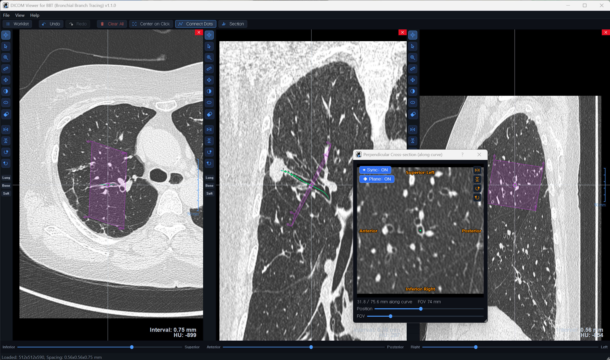

# PACS for BBT — DICOM Viewer for Bronchial Branch Tracing

> 🇰🇷 한국어 안내는 아래에 있습니다.

**PACS for BBT** is a free chest-CT viewer built for practicing **Bronchial Branch Tracing (BBT)** — drawing bronchial branch diagrams for bronchoscopy planning. It works with chest-CT **DICOM files** (load a DICOM series folder to get started).

> [!IMPORTANT]
> **Load AXIAL-plane DICOM data only.** Put a single axial series in the folder — the coronal and sagittal views are reconstructed automatically from it. If axial, coronal, and sagittal series are mixed in one folder, loading will fail or produce a corrupted volume.

*Tracing an airway with dots connected into a smooth 3D curve (green), and viewing the CT cross-section perpendicular to it. The overlaid rectangle shows where the section plane cuts through each of the three views, with real-time anatomical orientation labels (e.g. Superior-Left) in the section window.*

### Key features
- **Three synchronized planes** (Axial / Coronal / Sagittal) with distance measurement, 3D sphere/ellipsoid annotation, and per-plane window presets (Lung / Bone / Soft)
- **Airway tracing** — use the Dots tool to place dots along a bronchus, then connect them into a smooth 3D curve
- **Perpendicular cross-sections** — view CT sections perpendicular to the traced airway; the cutting plane follows the curve, and the main views show where it cuts
- **Color-coded orientation** — the four edges of the section and the matching cutting-plane rectangle are color-coded, so you can instantly tell how the section is oriented in 3D
- **Worklist** for switching between multiple studies, with per-study annotations
- Built-in user manual (English / Korean) with PDF export

### Download
Grab **`PACS-for-BBT.exe`** from the [latest release](../../releases/latest). No installation required — just run it. (Windows 10/11, 64-bit)

> ⚠️ On first run, Windows SmartScreen may warn about an unknown publisher. Click **More info → Run anyway**.

### ⚠️ Disclaimer
**For educational & training use only.** This software is NOT an approved or certified medical device (including SaMD) and has not been cleared by any regulatory authority (FDA / CE / MFDS). It must NOT be used for clinical diagnosis, treatment, or patient care.

---

# 🇰🇷 한국어

**PACS for BBT**는 기관지내시경을 위한 **기관지 가지 추적(BBT) 다이어그램 그리기 연습**용 무료 흉부 CT 뷰어입니다. 흉부 CT **DICOM 파일**을 사용합니다 (DICOM 시리즈 폴더를 불러와서 시작).

> [!IMPORTANT]
> **AXIAL(축상면) DICOM 데이터만 넣어야 합니다.** 폴더에 axial 시리즈 하나만 넣으세요 — coronal/sagittal 은 axial 로부터 자동으로 생성됩니다. 한 폴더에 axial·coronal·sagittal 시리즈가 섞여 있으면 로딩이 실패하거나 영상이 깨집니다.

*기관지를 따라 점을 찍어 부드러운 3D 곡선(초록)으로 연결하고, 그 곡선에 수직인 CT 단면을 보는 모습. 오버레이된 사각형이 세 평면 각각에서 절단면의 위치를 표시하며, 단면 창에는 해부학 방향 라벨(예: Superior-Left)이 실시간으로 표시됩니다.*

### 주요 기능
- **3평면 동시 보기** (Axial / Coronal / Sagittal) — 거리 측정, 3D 구/타원 주석, 평면별 창 프리셋(Lung / Bone / Soft)
- **기관지 추적** — Dots 도구로 기관지를 따라 점을 찍고 부드러운 3D 곡선으로 연결
- **수직 단면 보기** — 추적한 기관지에 수직인 CT 단면을 곡선을 따라가며 확인, 메인 화면에 절단면 위치 표시
- **색으로 구분되는 방향** — 단면의 네 변과 절단면 사각형이 같은 색으로 구분되어, 단면이 3D에서 어느 방향인지 한눈에 파악
- **워크리스트** — 여러 스터디 전환, 스터디별 주석 저장
- 내장 사용 설명서 (한국어/영어, PDF 저장 가능)

### 다운로드
[최신 릴리스](../../releases/latest)에서 **`PACS-for-BBT.exe`**를 받아 바로 실행하면 됩니다. 설치 불필요. (Windows 10/11, 64비트)

> ⚠️ 처음 실행 시 Windows SmartScreen 경고가 뜰 수 있습니다. **추가 정보 → 실행**을 누르세요.

### ⚠️ 주의
**교육·훈련 전용입니다.** 승인·인증된 의료기기가 아니며(SaMD 포함), 어떤 규제기관(FDA/CE/MFDS)의 허가도 받지 않았습니다. 임상 진단·치료·환자 진료에 사용할 수 없습니다.
